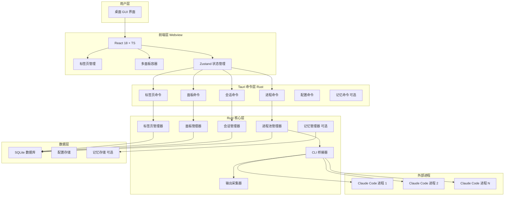
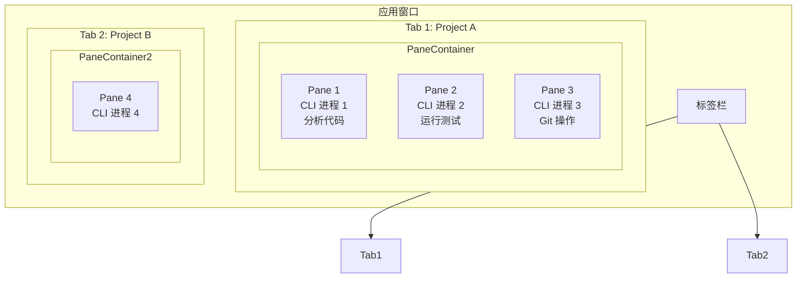

# Claude Code Desktop 应用架构设计方案

**版本：** v2.4  
**日期：** 2026-03-18  
**作者：** 老张（系统架构师）  
**状态：** 待评审  
**核心设计**：每会话独立 CLI 进程 + 多面板分屏（tmux 风格）+ 可选记忆模块

---

## 1. 业务需求分析

### 1.1 核心目标
打造一款跨平台桌面应用，完美支持 Claude Code 所有功能，提供可视化操作界面，优化中文用户体验。

### 1.2 核心功能清单

| 功能模块 | 功能点 | 优先级 | 说明 |
|----------|--------|--------|------|
| **会话管理** | 多会话创建/切换/保存 | P0 | 每会话独立 CLI 进程 |
| | 会话历史记录与搜索 | P0 | SQLite 持久化 |
| | 会话导出/导入 | P1 | JSON/Markdown |
| **多面板分屏** | 标签页内分屏（tmux 风格） | P0 | 一标签页多 CLI 实例 |
| | 自由分割/调整大小 | P0 | 递归分割面板 |
| | 快捷键切换焦点 | P0 | 类似 tmux 操作 |
| | 布局保存/恢复 | P1 | 持久化面板配置 |
| **代码交互** | 代码文件浏览与编辑 | P0 | Monaco Editor |
| | 代码 diff 查看与接受/拒绝 | P0 | 实时 diff |
| | 多文件批量操作 | P0 | 批量 accept/reject |
| **终端集成** | 内置终端执行命令 | P0 | 每面板独立终端 |
| | 命令输出实时展示 | P0 | 流式输出 |
| | 命令历史与收藏 | P1 | 跨会话共享 |
| **AI 对话** | 流式响应展示 | P0 | SSE 实时渲染 |
| | 代码块高亮与复制 | P0 | Monaco 语法高亮 |
| | 中文优化展示 | P0 | UTF-8 + 字体优化 |
| **项目管理** | 多项目支持 | P0 | 项目配置隔离 |
| | 项目配置管理 | P0 | .claude 配置编辑 |
| | 项目快速切换 | P1 | 下拉菜单切换 |
| **设置中心** | API Key 管理 | P0 | 系统密钥链存储 |
| | 模型选择与配置 | P0 | 多模型支持 |
| | 主题与界面定制 | P1 | 明/暗主题 |
| **记忆管理** | 自动捕获/回忆（可选） | P2 | 插件式模块 |
| | 关键词搜索 | P2 | SQLite FTS |
| | 语义搜索（可选） | P3 | 向量索引 |

### 1.3 技术难点
1. **多会话进程隔离** — 每会话独立 CLI 进程，上下文隔离
2. **多面板进程管理** — 一标签页内多个面板各自独立进程
3. **进程池管理** — 限制并发数，资源控制
4. **跨平台兼容性** — Windows/macOS/Linux 三端一致体验
5. **流式响应处理** — SSE 流式数据的实时渲染
6. **Rust 异步编程** — tokio 异步运行时与前端通信

---

## 2. 整体架构

### 2.1 架构图



### 2.2 多面板分屏架构



### 2.3 核心设计原则

**每面板独立 CLI 进程**
```
Tab 1
├── Pane 1 ──────► CLI 进程 1 ──────► project-foo/ (分析)
├── Pane 2 ──────► CLI 进程 2 ──────► project-foo/ (测试)
└── Pane 3 ──────► CLI 进程 3 ──────► project-foo/ (Git)

Tab 2
└── Pane 4 ──────► CLI 进程 4 ──────► project-bar/
```

**为什么这样设计？**
- 上下文隔离：每个面板有独立的 Claude Code 上下文
- 任务并行：同一项目可同时进行多个任务
- 状态独立：切换面板不影响其他面板运行
- 故障隔离：一个进程崩溃不影响其他面板
- 资源控制：进程池限制最大并发数

---

## 3. 核心模块详解

### 3.1 标签页管理器（Tab Manager）

**职责**
- 管理标签页的创建、切换、关闭
- 维护标签页与面板的关系
- 持久化标签页布局

**数据结构**
```rust
// src-tauri/src/tab/types.rs

use serde::{Deserialize, Serialize};

/// 面板布局类型
#[derive(Debug, Clone, Serialize, Deserialize)]
pub enum PaneLayout {
    Horizontal,  // 水平分割
    Vertical,    // 垂直分割
}

/// 分割方向
#[derive(Debug, Clone, Serialize, Deserialize)]
pub enum SplitDirection {
    Horizontal,  // 左右分割
    Vertical,    // 上下分割
}

/// 面板信息
#[derive(Debug, Clone, Serialize, Deserialize)]
pub struct Pane {
    pub pane_id: String,           // 面板唯一 ID
    pub session_id: String,        // 关联的会话 ID
    pub size: (f32, f32),          // 宽高比例 (0.0-1.0)
    pub min_size: (f32, f32),      // 最小尺寸 (0.1, 0.1)
    pub is_active: bool,           // 是否当前焦点
}

/// 标签页信息
#[derive(Debug, Clone, Serialize, Deserialize)]
pub struct Tab {
    pub tab_id: String,            // 标签页唯一 ID
    pub project_id: String,        // 所属项目 ID
    pub project_path: String,      // 项目路径
    pub title: String,             // 标签页标题
    pub panes: Vec<Pane>,          // 面板列表
    pub active_pane_id: String,    // 当前焦点面板 ID
    pub layout_tree: LayoutNode,   // 布局树
    pub created_at: i64,
    pub updated_at: i64,
}

/// 布局树节点（支持递归分割）
#[derive(Debug, Clone, Serialize, Deserialize)]
pub struct LayoutNode {
    pub node_type: LayoutNodeType,
    pub direction: Option<PaneLayout>,
    pub children: Vec<LayoutNode>,
    pub pane_id: Option<String>,   // 仅 Leaf 节点有
    pub size: f32,                 // 占比 0.0-1.0
}

#[derive(Debug, Clone, Serialize, Deserialize)]
pub enum LayoutNodeType {
    Leaf,   // 叶子节点（包含实际面板）
    Split,  // 分割节点（包含子节点）
}
```

**核心接口**
```rust
// src-tauri/src/tab/manager.rs

pub struct TabManager {
    db: Arc<Mutex<SqliteConnection>>,
    process_pool: Arc<ProcessPool>,
    session_manager: Arc<SessionManager>,
}

impl TabManager {
    /// 创建新标签页
    pub async fn create_tab(
        &self,
        project_id: String,
        project_path: String,
        title: String,
    ) -> Result<Tab, TabError> {
        let tab_id = uuid::Uuid::new_v4().to_string();
        let pane_id = uuid::Uuid::new_v4().to_string();
        
        // 创建默认会话
        let session = self.session_manager
            .create_session(project_id.clone(), project_path.clone(), "Main".to_string())
            .await?;
        
        // 创建初始面板
        let pane = Pane {
            pane_id: pane_id.clone(),
            session_id: session.id.clone(),
            size: (1.0, 1.0),
            min_size: (0.1, 0.1),
            is_active: true,
        };
        
        // 创建布局树
        let layout_tree = LayoutNode {
            node_type: LayoutNodeType::Leaf,
            direction: None,
            children: vec![],
            pane_id: Some(pane_id.clone()),
            size: 1.0,
        };
        
        let tab = Tab {
            tab_id,
            project_id,
            project_path,
            title,
            panes: vec![pane],
            active_pane_id: pane_id,
            layout_tree,
            created_at: chrono::Utc::now().timestamp(),
            updated_at: chrono::Utc::now().timestamp(),
        };
        
        self.db.insert_tab(&tab).await?;
        
        Ok(tab)
    }
    
    /// 分割面板
    pub async fn split_pane(
        &self,
        tab_id: &str,
        pane_id: &str,
        direction: SplitDirection,
    ) -> Result<Pane, TabError> {
        // ... 实现略
    }
    
    /// 关闭面板
    pub async fn close_pane(
        &self,
        tab_id: &str,
        pane_id: &str,
    ) -> Result<(), TabError> {
        // ... 实现略
    }
    
    /// 切换焦点面板
    pub async fn focus_pane(
        &self,
        tab_id: &str,
        pane_id: &str,
    ) -> Result<(), TabError> {
        // ... 实现略
    }
    
    /// 按方向切换焦点
    pub async fn focus_pane_by_direction(
        &self,
        tab_id: &str,
        direction: FocusDirection,
    ) -> Result<String, TabError> {
        // ... 实现略
    }
}

/// 焦点切换方向
#[derive(Debug, Clone)]
pub enum FocusDirection {
    Up,
    Down,
    Left,
    Right,
}
```

---

### 3.2 会话管理器（Session Manager）

**职责**
- 管理会话的创建、切换、关闭
- 维护会话与 CLI 进程的映射关系
- 持久化会话状态到 SQLite

**数据结构**
```rust
// src-tauri/src/session/types.rs

/// 会话状态
pub enum SessionStatus {
    Idle,       // 空闲，无 CLI 进程
    Starting,   // 正在启动 CLI 进程
    Running,    // CLI 进程运行中
    Waiting,    // 等待用户输入
    Error,      // 进程出错
    Closed,     // 已关闭
}

/// 会话信息
pub struct Session {
    pub id: String,              // 会话唯一 ID
    pub project_id: String,      // 所属项目 ID
    pub project_path: String,    // 项目路径
    pub pane_id: String,         // 所属面板 ID
    pub title: String,           // 会话标题
    pub status: SessionStatus,   // 会话状态
    pub process_id: Option<u32>, // 关联的 CLI 进程 PID
    pub created_at: i64,         // 创建时间
    pub updated_at: i64,         // 更新时间
    pub message_count: i32,      // 消息数量
}
```

---

### 3.3 进程池管理器（Process Pool Manager）

**职责**
- 管理所有 CLI 子进程的生命周期
- 限制最大并发进程数
- 监控进程状态
- 进程崩溃时通知上层

**配置**
```rust
// src-tauri/src/process/config.rs

pub struct ProcessPoolConfig {
    /// 全局最大并发进程数（默认 10）
    pub max_global: usize,
    
    /// 每标签页最大进程数（默认 5）
    pub max_per_tab: usize,
    
    /// 进程启动超时（默认 30 秒）
    pub startup_timeout_ms: u64,
    
    /// 进程空闲超时（默认 10 分钟无输出则清理）
    pub idle_timeout_ms: u64,
    
    /// 进程崩溃后自动重启（默认 false）
    pub auto_restart: bool,
    
    /// Claude Code 可执行文件路径
    pub claude_executable: String,
}
```

**数据结构**
```rust
// src-tauri/src/process/types.rs

/// 进程状态
pub enum ProcessStatus {
    Starting,   // 正在启动
    Running,    // 运行中
    Idle,       // 空闲（无输出）
    Crashed,    // 崩溃
    Killed,     // 被手动终止
    Timeout,    // 超时被杀
}

/// 进程信息
pub struct ProcessInfo {
    pub pid: u32,
    pub session_id: String,
    pub pane_id: String,         // 所属面板 ID
    pub tab_id: String,          // 所属标签页 ID
    pub project_path: String,
    pub status: ProcessStatus,
    pub started_at: i64,
    pub last_output_at: i64,
    pub exit_code: Option<i32>,
    pub restart_count: u32,
}

/// 进程输出
pub struct ProcessOutput {
    pub pid: u32,
    pub pane_id: String,         // 面板 ID（用于路由到正确面板）
    pub stream: OutputStream,    // Stdout 或 Stderr
    pub content: String,
    pub timestamp: i64,
}
```

---

### 3.4 前端多面板管理

**状态管理（Zustand）**
```typescript
// src/stores/useTabStore.ts

interface Pane {
  paneId: string;
  sessionId: string;
  size: [number, number];  // 宽高比例
  isActive: boolean;
}

interface Tab {
  tabId: string;
  projectId: string;
  projectPath: string;
  title: string;
  panes: Pane[];
  activePaneId: string;
  layoutTree: LayoutNode;
}

interface TabState {
  tabs: Map<string, Tab>;
  activeTabId: string | null;
  
  createTab: (projectId: string, projectPath: string, title: string) => Promise<Tab>;
  closeTab: (tabId: string) => Promise<void>;
  switchTab: (tabId: string) => void;
  splitPane: (tabId: string, paneId: string, direction: 'horizontal' | 'vertical') => Promise<Pane>;
  closePane: (tabId: string, paneId: string) => Promise<void>;
  focusPane: (tabId: string, paneId: string) => void;
  focusPaneByDirection: (tabId: string, direction: 'up' | 'down' | 'left' | 'right') => Promise<void>;
}
```

---

### 3.5 快捷键设计

**快捷键速查表**

| 快捷键 | 功能 | 备注 |
|--------|------|------|
| `Cmd+D` | 水平分割面板 | 左右布局 |
| `Cmd+Shift+D` | 垂直分割面板 | 上下布局 |
| `Cmd+W` | 关闭当前面板 | 保留最后面板 |
| `Cmd+Shift+W` | 关闭标签页 | |
| `Cmd+←/→/↑/↓` | 焦点导航 | tmux 风格 |
| `Cmd+{N}` | 切换到第 N 个标签页 | |
| `Cmd+T` | 新建标签页 | |
| `Enter` | 发送输入到当前面板 | |

---

## 4. 数据库设计

### 4.1 表结构

```sql
-- 标签页表
CREATE TABLE tabs (
  id TEXT PRIMARY KEY,
  project_id TEXT NOT NULL,
  project_path TEXT NOT NULL,
  title TEXT NOT NULL,
  active_pane_id TEXT,
  layout_tree JSON NOT NULL,
  created_at INTEGER NOT NULL,
  updated_at INTEGER NOT NULL
);

-- 面板表
CREATE TABLE panes (
  id TEXT PRIMARY KEY,
  tab_id TEXT NOT NULL,
  session_id TEXT NOT NULL,
  size_x REAL NOT NULL DEFAULT 1.0,
  size_y REAL NOT NULL DEFAULT 1.0,
  is_active INTEGER NOT NULL DEFAULT 0,
  created_at INTEGER NOT NULL,
  FOREIGN KEY (tab_id) REFERENCES tabs(id) ON DELETE CASCADE,
  FOREIGN KEY (session_id) REFERENCES sessions(id) ON DELETE CASCADE
);

-- 会话表
CREATE TABLE sessions (
  id TEXT PRIMARY KEY,
  project_id TEXT NOT NULL,
  project_path TEXT NOT NULL,
  pane_id TEXT,
  title TEXT NOT NULL,
  status TEXT NOT NULL DEFAULT 'idle',
  process_id INTEGER,
  created_at INTEGER NOT NULL,
  updated_at INTEGER NOT NULL,
  message_count INTEGER DEFAULT 0
);

-- 项目表
CREATE TABLE projects (
  id TEXT PRIMARY KEY,
  name TEXT NOT NULL,
  path TEXT UNIQUE NOT NULL,
  config JSON,
  last_opened_at INTEGER,
  created_at INTEGER NOT NULL
);
```

---

## 5. Tauri Commands 接口

### 5.1 标签页相关

```rust
#[tauri::command]
async fn create_tab(app_handle: AppHandle, project_id: String, project_path: String, title: String) -> Result<Tab, String>;

#[tauri::command]
async fn close_tab(app_handle: AppHandle, tab_id: String) -> Result<(), String>;

#[tauri::command]
async fn list_tabs(app_handle: AppHandle) -> Result<Vec<Tab>, String>;
```

### 5.2 面板相关

```rust
#[tauri::command]
async fn split_pane(app_handle: AppHandle, tab_id: String, pane_id: String, direction: SplitDirection) -> Result<Pane, String>;

#[tauri::command]
async fn close_pane(app_handle: AppHandle, tab_id: String, pane_id: String) -> Result<(), String>;

#[tauri::command]
async fn focus_pane(app_handle: AppHandle, tab_id: String, pane_id: String) -> Result<(), String>;

#[tauri::command]
async fn focus_pane_by_direction(app_handle: AppHandle, tab_id: String, direction: FocusDirection) -> Result<String, String>;
```

### 5.3 会话相关

```rust
#[tauri::command]
async fn create_session(app_handle: AppHandle, project_id: String, project_path: String, title: String) -> Result<Session, String>;

#[tauri::command]
async fn start_session(app_handle: AppHandle, session_id: String) -> Result<u32, String>;

#[tauri::command]
async fn close_session(app_handle: AppHandle, session_id: String) -> Result<(), String>;
```

---

## 6. 事件流设计

### 6.1 事件类型

```typescript
interface ProcessStartedEvent {
  type: 'process:started';
  payload: { pid: number; paneId: string; sessionId: string; };
}

interface ProcessOutputEvent {
  type: 'process:output';
  payload: { pid: number; paneId: string; sessionId: string; stream: 'stdout' | 'stderr'; content: string; };
}

interface ProcessExitedEvent {
  type: 'process:exited';
  payload: { pid: number; paneId: string; sessionId: string; exitCode: number; };
}
```

---

## 7. 错误处理

### 7.1 错误类型

```rust
#[derive(Debug, thiserror::Error)]
pub enum TabError {
    #[error("Tab not found: {0}")]
    NotFound(String),
    #[error("Pane not found: {0}")]
    PaneNotFound(String),
    #[error("Cannot close last pane")]
    CannotCloseLastPane,
}

#[derive(Debug, thiserror::Error)]
pub enum ProcessError {
    #[error("Max global concurrent processes reached")]
    MaxGlobalReached,
    #[error("Max concurrent processes per tab reached")]
    MaxPerTabReached,
    #[error("Failed to spawn process: {0}")]
    SpawnFailed(String),
}
```

---

## 8. 性能优化

### 8.1 进程输出缓冲

```
┌────────────────────────────────────────┐
│         多面板输出缓冲策略               │
├────────────────────────────────────────┤
│ 1. 每面板独立 Ring Buffer (最大 10000 行)│
│ 2. 事件节流（最多 50fps per pane）       │
│ 3. 前端虚拟列表（Monaco 虚拟滚动）       │
│ 4. 事件路由优化（按面板 ID 路由）         │
└────────────────────────────────────────┘
```

---

## 9. 记忆管理模块（可选）

### 9.1 模块定位
- **可选功能**：用户可选择启用/禁用
- **三种模式**：基础版（无向量）/ 本地向量版 / 云端向量版
- **插件式架构**：不依赖核心功能

---

## 10. 安装与部署

### 10.1 安装方式

```bash
# macOS: 下载 .dmg，双击安装
# Linux: 下载 .deb/.AppImage
# Windows: 下载 .exe 安装包
```

### 10.2 配置文件

```json
// ~/.claude-desktop/config.json

{
  "maxConcurrentSessions": 10,
  "maxPanesPerTab": 5,
  "claudeExecutable": "/usr/local/bin/claude",
  "theme": "dark",
  "memory": {
    "enabled": false,
    "vectorSearch": false
  }
}
```

---

## 11. CI/CD 构建配置

### 11.1 开发环境说明

**背景**：项目在 Linux 服务器上开发，但 macOS 应用只能在 macOS 上构建（Apple 限制）。

**解决方案**：使用 GitHub Actions 免费的 macOS runner 自动构建。

### 11.2 GitHub Actions 工作流

```yaml
# .github/workflows/build.yml
name: Build Desktop App

on:
  push:
    branches: [main, develop]
    tags: ['v*']
  workflow_dispatch:  # 手动触发

jobs:
  build-macos:
    runs-on: macos-latest
    steps:
      - name: Checkout
        uses: actions/checkout@v4
      
      - name: Setup Node.js
        uses: actions/setup-node@v4
        with:
          node-version: '20'
          cache: 'npm'
      
      - name: Setup Rust
        uses: dtolnay/rust-toolchain@stable
        with:
          targets: aarch64-apple-darwin, x86_64-apple-darwin
      
      - name: Install dependencies
        run: npm ci
      
      - name: Build Tauri app
        uses: tauri-apps/tauri-action@v0
        env:
          GITHUB_TOKEN: ${{ secrets.GITHUB_TOKEN }}
        with:
          tagName: ${{ github.ref_name }}
          releaseName: 'Claude Code Desktop ${{ github.ref_name }}'
          releaseBody: 'See CHANGELOG.md for details.'
          releaseDraft: true
          prerelease: false
          args: --target universal-apple-darwin
      
      - name: Upload artifact
        uses: actions/upload-artifact@v4
        with:
          name: macos-universal
          path: |
            src-tauri/target/universal-apple-darwin/release/bundle/dmg/*.dmg
            src-tauri/target/universal-apple-darwin/release/bundle/macos/*.app

  build-linux:
    runs-on: ubuntu-22.04
    steps:
      - name: Checkout
        uses: actions/checkout@v4
      
      - name: Setup Node.js
        uses: actions/setup-node@v4
        with:
          node-version: '20'
          cache: 'npm'
      
      - name: Setup Rust
        uses: dtolnay/rust-toolchain@stable
      
      - name: Install system dependencies
        run: |
          sudo apt-get update
          sudo apt-get install -y \
            libgtk-3-dev \
            libwebkit2gtk-4.1-dev \
            libappindicator3-dev \
            librsvg2-dev \
            patchelf \
            libasound2-dev
      
      - name: Install dependencies
        run: npm ci
      
      - name: Build Tauri app
        run: npm run tauri build
      
      - name: Upload .deb
        uses: actions/upload-artifact@v4
        with:
          name: linux-deb
          path: src-tauri/target/release/bundle/deb/*.deb
      
      - name: Upload .AppImage
        uses: actions/upload-artifact@v4
        with:
          name: linux-appimage
          path: src-tauri/target/release/bundle/appimage/*.AppImage

  build-windows:
    runs-on: windows-latest
    steps:
      - name: Checkout
        uses: actions/checkout@v4
      
      - name: Setup Node.js
        uses: actions/setup-node@v4
        with:
          node-version: '20'
          cache: 'npm'
      
      - name: Setup Rust
        uses: dtolnay/rust-toolchain@stable
        with:
          targets: x86_64-pc-windows-msvc
      
      - name: Install dependencies
        run: npm ci
      
      - name: Build Tauri app
        run: npm run tauri build
      
      - name: Upload .exe
        uses: actions/upload-artifact@v4
        with:
          name: windows-exe
          path: src-tauri/target/release/*.exe
      
      - name: Upload .msi
        uses: actions/upload-artifact@v4
        with:
          name: windows-msi
          path: src-tauri/target/release/bundle/msi/*.msi

  release:
    needs: [build-macos, build-linux, build-windows]
    runs-on: ubuntu-latest
    if: startsWith(github.ref, 'refs/tags/v')
    steps:
      - name: Download all artifacts
        uses: actions/download-artifact@v4
        with:
          path: artifacts
      
      - name: Create Release
        uses: softprops/action-gh-release@v1
        with:
          files: artifacts/**/*
          generate_release_notes: true
```

### 11.3 开发工作流

```
┌─────────────────────────────────────────────────────────────┐
│                    开发 → 构建 → 使用                        │
├─────────────────────────────────────────────────────────────┤
│                                                             │
│  1. Linux 服务器开发                                         │
│     └─► 编写代码、运行测试                                    │
│                                                             │
│  2. 推送到 GitHub                                            │
│     └─► git push origin main                                │
│                                                             │
│  3. GitHub Actions 自动构建                                  │
│     ├─► macOS: macos-latest runner                          │
│     ├─► Linux: ubuntu-22.04 runner                          │
│     └─► Windows: windows-latest runner                      │
│                                                             │
│  4. 下载构建产物                                              │
│     └─► Actions → Artifacts → Download                      │
│                                                             │
│  5. 本地安装使用                                              │
│     ├─► macOS: 双击 .dmg                                     │
│     ├─► Linux: sudo dpkg -i xxx.deb                         │
│     └─► Windows: 双击 .exe                                   │
│                                                             │
└─────────────────────────────────────────────────────────────┘
```

### 11.4 手动触发构建

在 GitHub 仓库页面：
1. 点击 **Actions** 标签
2. 选择 **Build Desktop App** 工作流
3. 点击 **Run workflow**
4. 选择分支后运行

### 11.5 本地开发测试

```bash
# Linux 服务器上开发时，只构建 Linux 版本
npm install
npm run tauri dev

# 仅构建前端（跳过 Rust 编译，更快）
npm run dev
```

### 11.6 构建产物

| 平台 | 文件格式 | 大小（估算） | 说明 |
|------|---------|-------------|------|
| macOS | .dmg | ~15 MB | Universal Binary (Intel + M1/M2) |
| Linux | .deb | ~12 MB | Ubuntu/Debian |
| Linux | .AppImage | ~14 MB | 通用 Linux |
| Windows | .exe | ~10 MB | 安装包 |
| Windows | .msi | ~11 MB | MSI 安装包 |

### 11.7 成本

- **GitHub Actions**：公开仓库免费，私有仓库每月 2000 分钟免费
- **macOS runner**：消耗分钟数 × 10（但公开仓库不限）
- **自用场景**：完全免费

---

## 12. 风险点与应对

| 风险 | 概率 | 影响 | 应对策略 |
|------|------|------|---------|
| **进程泄漏** | 中 | 高 | 进程池限制 + 定期清理僵尸进程 |
| **内存占用过高** | 中 | 中 | 输出缓冲限制 + 虚拟列表 |
| **CLI 进程崩溃** | 中 | 中 | 错误捕获 + 重启选项 |
| **跨平台兼容性** | 高 | 中 | 抽象层 + 平台适配 |
| **并发数过多** | 中 | 中 | 全局限制 10 + 每标签页限制 5 |
| **面板布局错乱** | 低 | 低 | 布局树验证 + 回滚机制 |
| **macOS 构建失败** | 低 | 中 | GitHub Actions 自动化 + 版本锁定 |

---

## 13. 开发计划

### Phase 1: 核心功能（6 周）
- 标签页管理
- 面板分割/关闭
- 进程池管理
- 基础 UI
- CI/CD 配置

### Phase 2: 增强功能（4 周）
- 布局保存/恢复
- 拖拽调整大小
- 快捷键完善
- 性能优化

### Phase 3: 可选功能（3 周）
- 记忆管理模块
- 云端同步
- 主题定制

---

## 14. 下一步行动

```
□ 确认多面板分屏设计
□ 确认进程池限制策略（全局 10 / 每标签页 5）
□ 确认快捷键设计
□ 确认 CI/CD 构建方案
□ 确认不需要 Apple Developer ID（自用）
□ 进入开发阶段
```

---

**文档结束**

v2.4 架构设计已完成，核心设计：
- 每面板独立 CLI 进程
- tmux 风格多面板分屏
- 递归分割布局树
- 快捷键焦点导航
- 进程池限制（全局 10 / 每标签页 5）
- 布局保存/恢复
- GitHub Actions CI/CD（跨平台构建）
- 无需 Apple Developer ID（自用场景）
